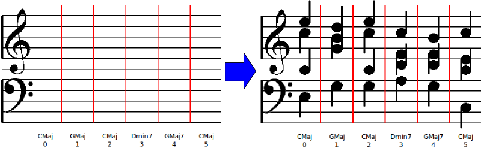

# FourVoices

## Table of Contents
1. About
2. GitHub
3. Prerequisites
4. How to Run
5. Contact
6. History
7. Acknowledgements

## 1. About

FourVoices is an **automatic music generator** for **four-part writing**
(Soprano, alto, tenor, bass).

For a description of the capabilities of FourVoices, including instructions on how to use it, please read the [FourVoices Wiki](https://github.com/erickim555/FourVoices/wiki).

This software is particularly useful for music theory students, eg for four-part
writing homework assignments.

**Features:**
- Automatic generation of correct four-part harmonizations
- Specify lines for each singer, eg provide the soprano line, and have the FourVoices fill in the rest of the voices.
- Chord modifiers: major/minor, seventh chords, diminished.
- User interface, as well as a command-line interface
- Audio playback
- Export vocal parts to PDF (Coming soon...)

FourVoices is an open source project: GNU GPL (ver3) license.

## 2. GitHub

FourVoices is on GitHub: [https://github.com/erickim555/FourVoices](https://github.com/erickim555/FourVoices)
    
## 3. Prerequisites

Tested on Windows 7, Ubuntu (12.04).

- Minimums:
    - Python 2.6.4/2.7.2: [Python](https://www.python.org/)
    - python-tk (Unix: sudo apt-get install python-tk)

- Optional:
    - Mingus
        - Used for MIDI playback: [Mingus](http://bspaans.github.io/python-mingus/index.html)
    - FluidSynth
        - Also used for MIDI playback (included in mingus): [FluidSynth](http://www.fluidsynth.org/)

### Installation (Unix)
First, clone the FourVoices repo into your desired location, ie:

    cd some/location
    git clone https://github.com/erickim555/FourVoices.git .

Then, install the reqiured dependencies. I recommend using a virtualenv to help make dependency management cleaner:

    # install Tkinter (Python UI library)
    sudo apt-get install python-tk

    # install virtualenv (if you don't already have it)
    pip install virtualenv

    # create virtualenv at FourVoices/venv/
    cd FourVoices
    virtualenv venv

    # enter virtual environment
    source venv/bin/activate

    # install Python dependencies
    pip install -r requirements.txt

Now you're ready to run FourVoices!

## 4. How to Run

If you're in Windows, double-click the `main.py` file.

If you're in Unix, simply do:

    python main.py

There is also a command-line interface (CLI) available in the `core/`
subdirectory:

    cd core/
    python solver.py PROBLEM

PROBLEM is the path to a harmonic problem - see `core/tests/TEMPLATE`
for an explanation on the file format.
Additionally, `core/tests/` contains example harmonic problems.

## 5. Contact

You can reach erickim555 either by messaging me via GitHub:

    https://github.com/erickim555
    
Or by e-mailing me at:

    erickim555@gmail.com

## 6. History

FourVoices was originally written by Eric Kim in Winter 2009
while he was an undergraduate at the University of California, 
Berkeley. 
An avid musician and composer, Eric was inspired to merge his love for
music with his passion for computer science after taking an
Artificial Intelligence course (cs188).
Recognizing that the rules of four-part writing can be easily
expressed as a constraint satisfaction problem, Eric spent the winter
break hacking together a four-part generator featuring a user interface.

## 7. Acknowledgements
    
FourVoice is powered by a Constraint 
Satisfaction Problem library written by Gustavo Niemeyer: [Python Constraint](http://labix.org/python-constraint)
